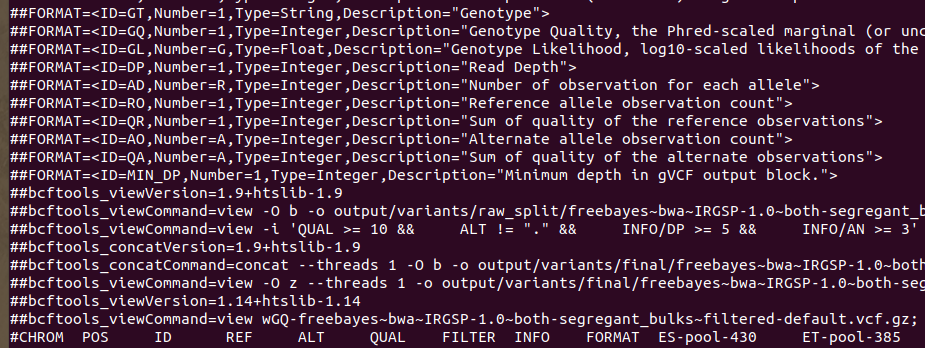

==================
QTL_BSA_in_Python
==================

:Author: Michael Hall
:Date:   4/13/2022

Examples:
=========

Load/install libraries
======================

.. code:: r 
   
   devtools::install_github("PBGLMichaelHall/Py_QTL_Parser",force = TRUE)
   library(PyQTLParser)
   library(vcfR)
::

   # Set the Working Directory to where VCF file is stored in file system
   # In this case it is in a directory named RiceCold
.. code:: r 

   setwd("/home/michael/Desktop/RiceCold/")
   
   
   
Pre-Filtering Rules
=================================================

.. code:: r

   Vcf file must only contain bialleleic variants. (filter upstream, e.g., with bcftools view -m2 -M2).
   
.. code:: r

   Also, the QTL analysis will only take SNPS, ie, length of REF and ALT== 1. However this is addressed in Py_QTL_Parser function.

=========================================================================================================================================================

VCF Format Fields and Bulk Segregant Sample Names
=================================================

.. code:: r

   I want to view the first line CHROM and relevant Format Fields because I know in order for this to work there must be a GQ (Genotype Quality) variable in the Format Field. 
      

   
R Script
========
   
.. code:: r
   
   file <- "wGQ-freebayes~bwa~IRGSP-1.0~both-segregant_bulks~filtered-default.vcf.gz"

   vcf <- read.vcfR(file)

   VCF_TIDY <- vcfR2tidy(vcf)
   
   Py_QTL_Parser(vcf = VCF_TIDY, HighBulk = "ET-pool-385", LowBulk = "ES-pool-430")
   
   # The file is named Hall.csv and should be in the working directory.
   # I want to inspect the imported header.
   
Header of Input CSV file with overall Quality Socres, Genotype Quality and Allelic Depths for both High and Low Bulks
======================================================================================================================
.. figure:: ../images/ga.png
   :alt: 

Python Script
=============

.. code:: r

   Run this command in Terminal calling the python script where 
   -i input file
   -o name of output directory where plots go
   -p population structure
   -b sample size from HighBulk,LowBulk
   
   python PyBSASeq.py -i Hall.csv -o RiceCold -p F2 -b 430,385

   Please refer to:
   https://github.com/dblhlx/PyBSASeq/tree/master/BulksOnly
   for more help
   
   # The analysis takes over 4 hours

Standard RStudio Console Output
===============================

.. figure:: ../images/lot.png
   :alt: 
   
Analysis Plot
=============
   
.. figure:: ../images/lot2.png
   :alt: 
