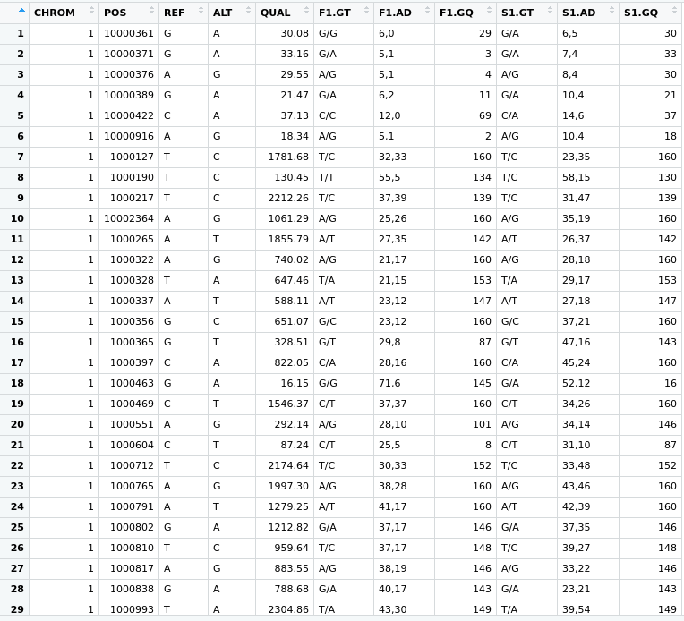
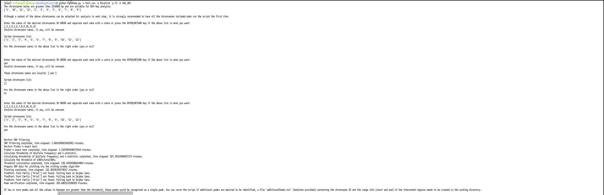
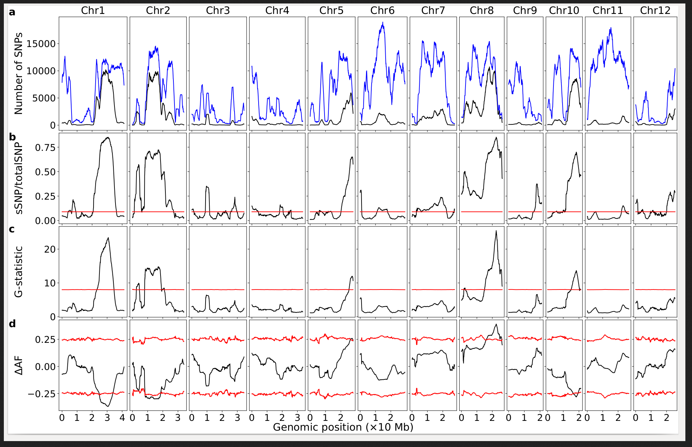

==================
QTL_BSA_in_Python
==================

:Author: Michael Hall
:Date:   4/13/2022

Citations
=========

Citation: If you used PyBSASeq in your pulications, please cite:

    Zhang, J., Panthee, D.R. PyBSASeq: a simple and effective algorithm for bulked segregant analysis with whole-genome sequencing data. BMC Bioinformatics 21, 99 (2020). https://doi.org/10.1186/s12859-020-3435-8
    Zhang, J., Panthee, D.R. Next-generation sequencing-based bulked segregant analysis without sequencing the parental genomes. G3 Genes|Genomes|Genetics, jkab400 (2021), https://doi.org/10.1093/g3journal/jkab400

Prerequisite Software Tools:
============================

.. code:: r

   **Install software environment through MAMBA**
   Mamba env create --file env/env.yaml
   conda activate PythsonBSA
   
   Python 3.6 or above is required to run the script.

   # For more efficient comupting of the algorithm please download Fisher's Exact Test.

   Installation

   Within this folder :

   git clone git://github.com/brentp/fishers_exact_test.git
   pip install .

   From PyPI: It is in environment file so if you installed it using this file **env.yaml** this step becomes unecessary

   **pip install fisher**

   Or install the development version :

   pip install https://github.com/brentp/fishers_exact_test.git
   
   **GATK**:
   
  git clone https://github.com/broadinstitute/gatk
  
  Navigate directory and find **gradlew** typing command*:
   **gradlew bundle**
   
   Determine that gatk is readable, writable, and executable and if it is not then,
   chmod +rwx 
   Verify 

   python gatk --help

Examples:
=========

Load/install libraries
======================

.. code:: r 
   
   devtools::install_github("PBGLMichaelHall/Py_QTL_Parser",force = TRUE)
   library(PyQTLParser)
   library(vcfR)
::

   # Set the Working Directory to where VCF file is stored in file system
   # In this case it is in a directory named RiceCold
.. code:: r 

   setwd("/home/michael/Desktop/RiceCold/")
   
   
   
Pre-Filtering Rules
=================================================

.. code:: r

   Vcf file must only contain bialleleic variants. (filter upstream, e.g., with bcftools view -m2 -M2 --types snps YOUR.vcf.gz).
   
   VCF file must be indexed. (tabix -p vcf YOUR.vcf.gz)
   
   VCF file must be annotated if using GATK method
   (bcftools annotate --rename-chrs renamechr.txt 
   wGQ-Filt-freebayes~bwa~IRGSP-1.0~both-segregant_bulks~filtered-default.SNP.Only.Bialleleic.vcf.gz
   > wGQ-Filt-freebayes~bwa~IRGSP-1.0~both-segregant_bulks~filtered-default.SNP.Only.Bialleleic.Intger.Chrom.vcf.gz)

=========================================================================================================================================================

VCF Format Fields and Bulk Segregant Sample Names
=================================================

.. code:: r

 
R Script
========
   
.. code:: r
   
   file <- "wGQ-freebayes~bwa~IRGSP-1.0~both-segregant_bulks~filtered-default.vcf.gz"

   vcf <- vcfR::read.vcfR(file)

   VCF_TIDY <- vcfR::vcfR2tidy(vcf)
   
   Py_QTL_Parser::Py_QTL_Parser_Bulks(vcf = VCF_TIDY, HighBulk = "ET-pool-385", LowBulk = "ES-pool-430",filename="RiceBulks")
   
   # The file is named Hall.csv and should be in the working directory.
   # I want to inspect the imported header.
   

.. code:: r

GATK (Non-Biased)
=================

.. code:: r

   python gatk VariantsToTable --variant YOUR.vcf.gz --fields CHROM --fields POS --fields REF 
   --fields ALT --fields QUAL --genotype-fields GT --genotype-fields AD --genotype-fields AD 
   --genotype-fields GQ --output Your.File.tsv

Python Script
=============

.. code:: r

   Run this command in Terminal calling the python script where 
   -i input file
   -o name of output directory where plots go
   -p population structure
   -b sample size from HighBulk,LowBulk
   -v alpha,smalpha
   -s slidingWindowSize,incrementalStep
   
   The default cutoff p-value for identifying significant SNPs (sSNP) from the SNP dataset is 0.01 (alpha), 
   and the default cutoff p-value for identifying sSNPs from the simulated dataset is 0.1 (smalpha). 
   These values can be changed using the following options:

   alpha and smalpha should be in the range of 0.0 – 1.0, the chosen value should make statistical sense. 
   The greater the smalpha value, the higher the threshold and the lower the false positive rate.

   The default size of the sliding window is 2000000 (base pairs) and the incremental step is 10000 (base pairs), 
   and their values can be changed using the following option:

   Please refer to:
   https://github.com/dblhlx/PyBSASeq/tree/master/BulksOnly
   for more help
   
   # The analysis takes over 4 hours

   # Call the python script by invoking python interpreter and include Hall.csv input file, 
   output directory name, population structure 'F2', and Bulk Sizes
   
   #Py_QTL_Parser::Py_QTL_Parser_Bulks
   python PyBSASeq.py -i RiceBulks.csv -o RiceCold.csv -p F2 -b 430,385
   
   #GATK
   python PyBSASeq.py -i Your.file.tsv -o Final.file.tsv -p F2 -b 430,385
   
   
   
   
Standard RStudio Console Output
===============================

.. code:: r

   
   
   
   
   
   
Analysis Plots: Number of SNPs called in window, SNP ratio, G Statistic and Delta AF or change in Allelic Frequencies
=====================================================================================================================

.. code:: r
   

Sorghum Semi-Dwarfism
---------------------

.. code:: r

    file <- "freebayes_D2.filtered.vcf"

    vcf <- vcfR::read.vcfR(file)

    VCF_TIDY <- vcfR::vcfR2tidy(vcf)

    Py_QTL_Parser::Py_QTL_Parser_Bulks(vcf = VCF_TIDY, HighBulk = "D2_F2_tt" , LowBulk = "D2_F2_TT",filename="SorghumBulks")

    #Windows Power Shell Terminal on Windows
    #Needed to download visual studio due to fisher exact test uses C++

    PS C:\Users\micha\OneDrive\Desktop> python .\PyBSASeq.py -i SorghumBulks.csv -o Sorghum.csv -p F2 
    --smooth TRUE -c 99,5,6,1 -b 45,38 -v .01,.01 -s 5000000,10000 -m 100,3

.. figure:: ../images/SSD.png

::
 
